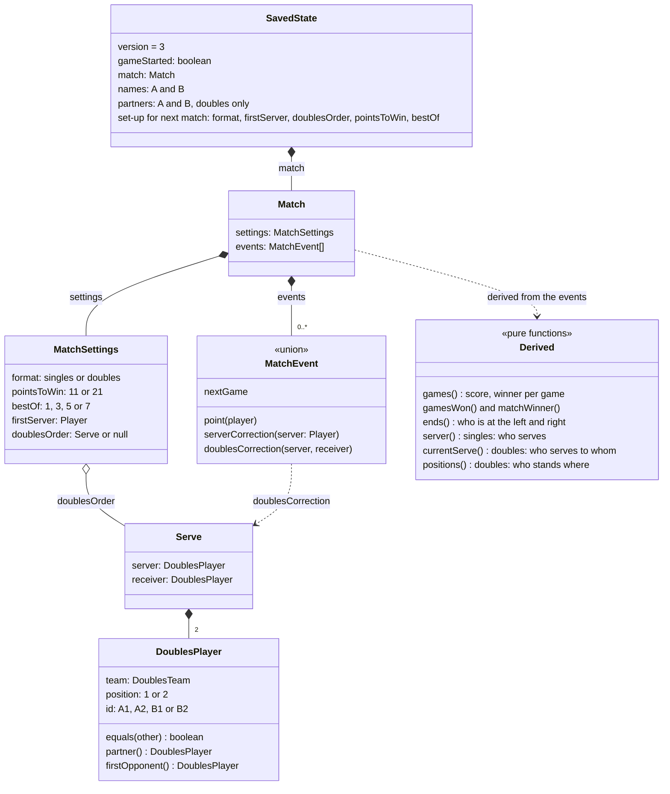
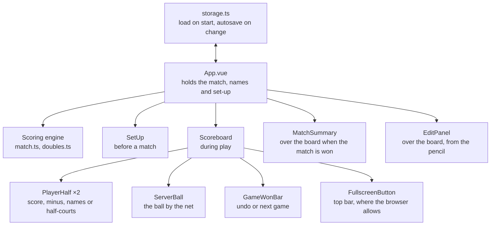

# Architecture

Two diagrams: what the app stores and derives (the data model), and how the screens are
wired together (the UI model). GitHub renders the Mermaid blocks below as diagrams.

Keep them up to date when the data model or the component tree changes.

## Data model

Only the match's settings and its list of events are stored. Everything a screen shows
(scores, winners, ends, who serves, where doubles players stand) is derived from the
events by pure functions, so undo is just removing the last event.

- **`Player`** is `'A'` or `'B'`: a side at the start of the match (A starts on the left).
  In doubles the same `A`/`B` is the team (`DoublesTeam`), since the team is what scores,
  wins games and changes ends.
- **`DoublesPlayer`** objects are compared with `equals()`, never `===`.
- The rules live in `src/scoring/match.ts`; doubles serve order and positions in
  `src/scoring/doubles.ts`. Saving and loading is `src/storage.ts`.

## UI model

`App.vue` is the only component with state. It turns the match into what each screen
needs and passes it down as props; screens report taps back as events, and `App.vue`
records them as new match events.

- **One screen at a time:** `SetUp` before a match, `Scoreboard` during it.
  `MatchSummary` and `EditPanel` appear on top of the board.
- **Doubles adds no screens.** It's extra data in the same props: each `PlayerHalf` shows
  who stands in which half-court, the ball sits in the server's half-court, and the edit
  panel lists four players.
- **Full screen is the browser's state, not the match's.** `FullscreenButton` asks the
  browser through `src/fullscreen.ts` and follows its events, so it needs nothing from
  `App.vue`. It isn't shown where pages can't go full screen (iPhones).
- **Tests** drive these screens through `test/driver.ts`, the way a player would.
